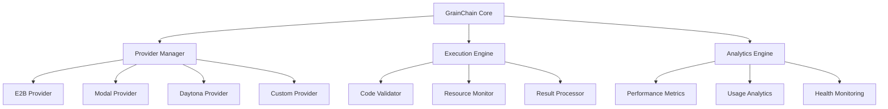

## Quick Start

Get up and running with GrainChain in minutes:

```bash
# Install GrainChain
pip install grainchain

# Set up your environment
cp .env.example .env
# Edit .env with your provider credentials

# Run a simple example
python -c "
from grainchain import GrainChain
gc = GrainChain()
result = gc.execute('print(\"Hello, GrainChain!\")')
print(result)
"
```

## What is GrainChain?

GrainChain is a powerful framework that extends Langchain with sandbox-aware capabilities, enabling you to build AI applications that can safely execute code in isolated environments. It provides seamless integration with multiple sandbox providers and offers comprehensive tools for monitoring, benchmarking, and optimizing your applications.

### Key Capabilities

- **Multi-Provider Support**: Works with E2B, Modal, Daytona, and other sandbox providers
- **Secure Code Execution**: Safe execution of untrusted code in isolated environments
- **Performance Optimization**: Built-in benchmarking and performance monitoring tools
- **Flexible Configuration**: Easy setup and customization for different use cases
- **Production Ready**: Comprehensive error handling, logging, and monitoring
- **Extensible Architecture**: Plugin system for custom providers and extensions

### Use Cases

- **AI Code Generation**: Safely execute and test generated code
- **Educational Platforms**: Provide secure coding environments for students
- **Code Analysis**: Analyze and execute code in controlled environments
- **Automated Testing**: Run tests in isolated sandbox environments
- **Research & Development**: Experiment with code execution patterns safely

## Architecture Overview



## Getting Help

- 📖 [Read the Guide](/guide/) - Comprehensive documentation
- 🔧 [API Reference](/api/) - Detailed API documentation
- 💻 [CLI Reference](/cli/) - Command-line interface guide
- 📝 [Examples](/examples/) - Practical examples and tutorials
- 🐛 [Report Issues](https://github.com/codegen-sh/grainchain/issues) - Bug reports and feature requests
- 💬 [Join our Discord](https://discord.gg/codegen) - Community support

## Quick Links

- [Installation Guide](/guide/installation) - Get GrainChain installed
- [Configuration](/guide/configuration) - Set up your environment
- [API Features](/api/features) - Explore core functionality
- [Benchmarking](/guide/benchmarking) - Performance testing tools
- [Troubleshooting](/guide/troubleshooting) - Common issues and solutions

